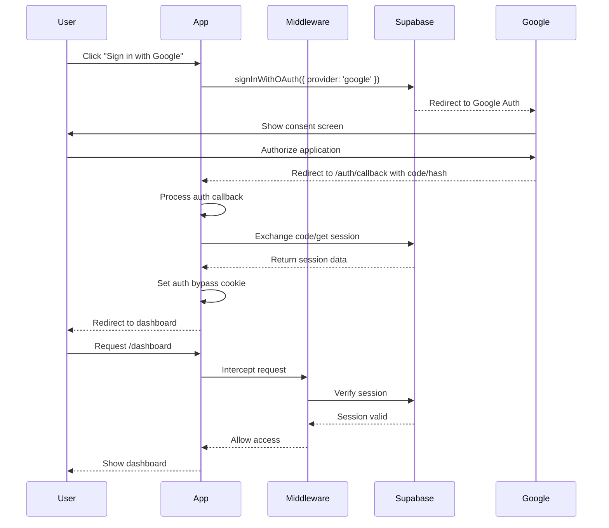
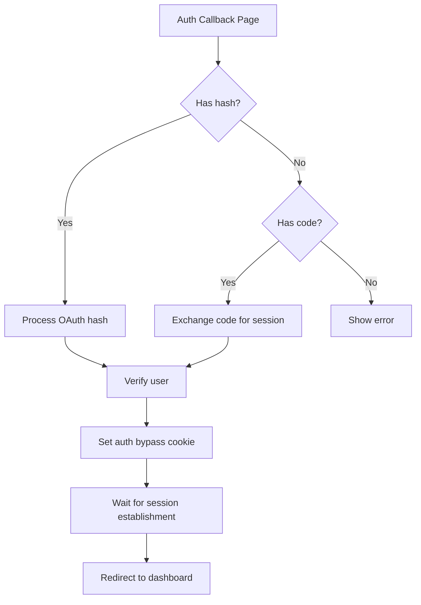
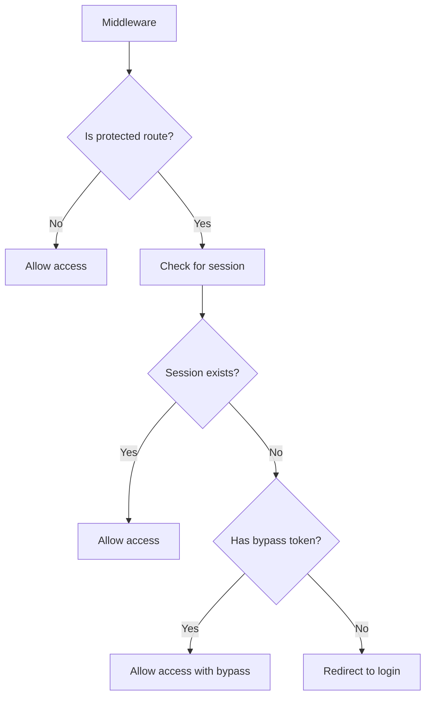
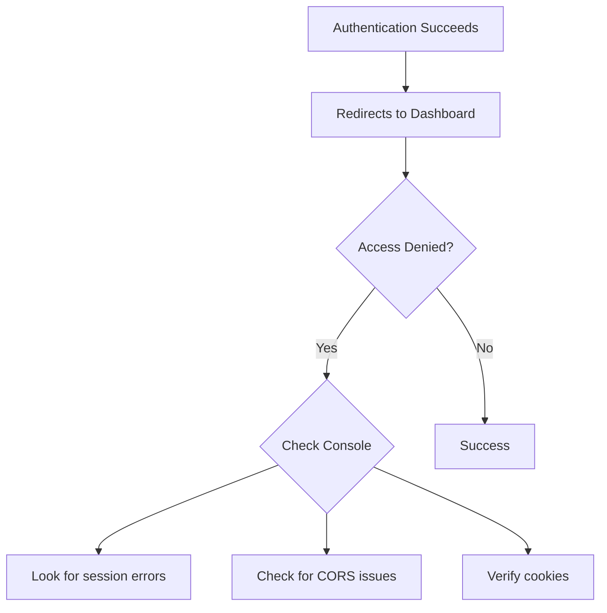

# Google Authentication Documentation

## Overview

This document explains how Google authentication works in our application, the complete authentication flow, how to set it up, and how to troubleshoot common issues.

## Authentication Flow Diagram



## Setup Requirements

### 1. Supabase Configuration

1. Go to your [Supabase dashboard](https://app.supabase.com)
2. Select your project
3. Navigate to **Authentication → Providers**
4. Find Google in the list and toggle it to **Enabled**
5. Add your Google OAuth credentials:
   - Client ID
   - Client Secret
6. Save changes

### 2. Google Cloud Console Setup

1. Go to the [Google Cloud Console](https://console.cloud.google.com)
2. Create a new project or select an existing one
3. Navigate to **APIs & Services → Credentials**
4. Configure the OAuth consent screen:
   - Add your app name, logo, and other required details
   - Add scopes for email and profile information
5. Create OAuth client ID credentials:
   - Application type: Web application
   - Name: Your application name
   - Authorized JavaScript origins: `https://your-app-url.com` (your production URL)
   - Authorized redirect URIs:
     - `https://[YOUR_PROJECT_REF].supabase.co/auth/v1/callback`
     - `http://localhost:3000/auth/callback` (for local development)
6. Click **Create** and note your Client ID and Client Secret

## Authentication Flow

### 1. Sign-In Initiation

- User clicks "Sign in with Google" button in your app
- The app calls `supabase.auth.signInWithOAuth()` with the Google provider
- Supabase redirects the user to Google's authentication page

```typescript
const { data, error } = await supabase.auth.signInWithOAuth({
  provider: 'google',
  options: {
    redirectTo: `${window.location.origin}/auth/callback`
  }
});
```

### 2. Google Authentication

- User authenticates on Google's page and grants permissions
- Google redirects back to your callback URL with either:
  - A code parameter (for auth code flow)
  - A hash fragment (for implicit flow)

### 3. Callback Processing

- The `/auth/callback` page receives the redirect from Google
- The page processes the authentication response:
  - For hash-based responses: Directly retrieve the session
  - For code-based responses: Exchange the code for a session
- The callback sets an auth bypass cookie to help with middleware verification



### 4. Session Establishment

- The callback makes several verification attempts to ensure the session is properly stored
- A delay is added to ensure session propagation
- The user is redirected to the dashboard page

### 5. Middleware Session Verification

- Next.js middleware intercepts requests to protected routes
- It creates a server-side Supabase client to verify the session
- For routes like `/dashboard`, it checks for a valid session
- If authenticated, access is granted; otherwise, the user is redirected to login



## Troubleshooting Common Issues

### "Missing authentication code" Error

This occurs when Google redirects back without a code or hash parameter.

**Possible causes:**
- OAuth configuration mismatch
- Redirect URI issues
- CORS problems

**Solutions:**
- Check the debug information in the error message for details
- Verify that your redirect URIs match exactly between Google Cloud Console and your app
- Ensure Google OAuth is properly enabled in Supabase

### Authentication Succeeds But Dashboard Access Denied

**Possible causes:**
- Session not fully established before redirect
- Cookie problems
- Middleware session verification issues

**Solutions:**
- Ensure the auth callback waits sufficiently before redirect (delay of 1000ms)
- Check for CORS or cookie setting issues
- Verify the auth bypass token is being set properly
- Check browser console for any errors



### Google OAuth Not Configured Error

If you see an error mentioning that Google OAuth isn't configured:

**Solutions:**
1. Ensure you've enabled Google provider in Supabase Authentication settings
2. Verify your Client ID and Client Secret are correctly set in Supabase
3. Check that your Google Cloud Console project has the correct redirect URIs

## Implementation Details

### Key Components

1. **OAuth Sign-In (useAuth hook)**:
   - Handles initiating the Google OAuth flow

2. **Auth Callback Page**:
   - Processes authentication response from Google
   - Handles both hash and code-based flows
   - Sets auth bypass cookie
   - Includes debugging information
   - Properly handles error states

3. **Middleware**:
   - Protects routes based on authentication state
   - Handles authentication bypass for OAuth sessions
   - Includes session refresh and validation

### Best Practices

1. **Error Handling & Debugging:**
   - The auth callback includes comprehensive debug information
   - All stages of the authentication flow are logged
   - Error states are properly handled at each step

2. **Session Management:**
   - Multiple verification attempts ensure session establishment
   - Delays allow for session propagation
   - Auth bypass tokens help handle edge cases in OAuth flows

3. **Security Considerations:**
   - Auth bypass tokens have short expiration (5 minutes)
   - Server-side session verification in middleware
   - Multiple layers of authentication checks

## Development vs. Production

### Local Development
- Use `http://localhost:3000/auth/callback` as an additional redirect URI in Google Cloud Console
- For testing, you can run the application locally with proper environment variables

### Production
- Ensure your production URL is properly configured in Google Cloud Console
- Update the redirect URIs to match your production domain
- Important: Make sure your application is configured to use the production domain for redirects

### Fixing Localhost Redirect in Production

If you're being redirected to `http://localhost:3000` after authentication in production:

1. **Check your OAuth configuration in Google Cloud Console**:
   - Go to [Google Cloud Console](https://console.cloud.google.com) → APIs & Services → Credentials
   - Edit your OAuth 2.0 Client ID
   - Ensure the appropriate production URL is in the "Authorized redirect URIs" list
   - Remove or comment out `http://localhost:3000/auth/callback` if not needed for development

2. **Check your application code**:
   - Ensure your `redirectTo` URL in the `signInWithOAuth` call uses the correct domain:
   ```typescript
   // CORRECT: Use dynamic origin detection
   const { data, error } = await supabase.auth.signInWithOAuth({
     provider: 'google',
     options: {
       redirectTo: `${window.location.origin}/auth/callback`
     }
   });
   
   // INCORRECT: Hardcoded localhost
   // redirectTo: 'http://localhost:3000/auth/callback'
   ```

3. **Check your environment variables**:
   - Make sure your production environment doesn't have any hardcoded localhost URLs
   - Verify that environment-specific configuration is correctly loaded

4. **Supabase Site URL configuration**:
   - In your Supabase dashboard, go to Authentication → URL Configuration
   - Update the Site URL to match your production domain
   - This ensures Supabase uses the correct domain for redirects

Remember: OAuth redirect URLs must match exactly between your application, Supabase configuration, and Google Cloud Console settings.

## Conclusion

The Google OAuth authentication flow is a multi-step process involving interaction between your application, Supabase, and Google's authentication servers. Understanding each component and how they interact helps in diagnosing and resolving authentication issues.

If you encounter persistent problems, check the debug information provided in the authentication callback page, which can help identify the specific point of failure in the authentication flow.

## Viewing the Mermaid Diagrams

To view the Mermaid diagrams in this documentation:

1. **GitHub:** If you're viewing this on GitHub, the diagrams should render automatically as GitHub supports Mermaid natively.

2. **VS Code:** Install the "Markdown Preview Mermaid Support" extension to see diagrams in the VS Code preview.

3. **Other Editors/Viewers:** If your editor doesn't support Mermaid, you can:
   - Use an online Mermaid editor like [Mermaid Live Editor](https://mermaid.live/)
   - Copy the diagram code and paste it there to visualize
   
4. **In our application:** To view diagrams directly in our application, visit:
   - Local development: `http://localhost:3000/documentation/google-auth`
   - Production: `https://your-production-domain.com/documentation/google-auth`

> **Note:** If you're running the development server on a different port, the documentation viewer will automatically adjust references to match your current port.
